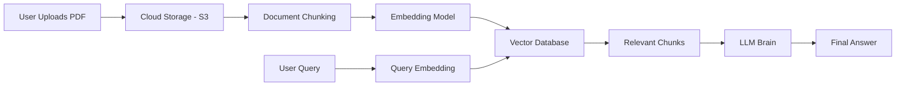
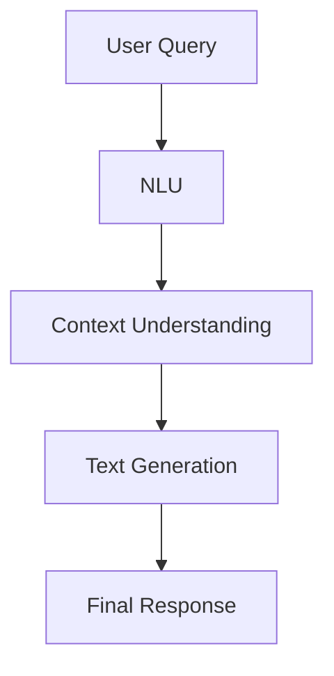

# 📘 LangChain: Introduction, System Design, Use Cases, and Benefits

---

## 1️⃣ Introduction to LangChain

### What is LangChain?

**LangChain** is an **open-source framework** designed to build applications powered by **Large Language Models (LLMs)** efficiently and reliably.

It abstracts:

* LLM orchestration
* Prompt chaining
* Context handling
* Data integration
* Memory management

👉 **Goal:** Enable developers to build **complex, production-ready LLM systems** without reinventing infrastructure.

---

## 2️⃣ Why Do We Need LangChain?

### The Real-World Problem

Consider building an application where:

* Users upload **PDF documents**
* Ask questions conversationally
* Request summaries or notes
* Query specific sections

### Challenges Without LangChain

* Handling large documents
* Chunking text
* Generating embeddings
* Semantic search
* Maintaining conversation memory
* Managing multiple LLM calls

🔴 **Building this from scratch is complex and error-prone**

✅ **LangChain solves this by providing reusable building blocks**

---

## 3️⃣ High-Level System Architecture

### End-to-End Workflow

---

## 4️⃣ Step-by-Step System Design Explanation

### Step 1: Document Upload

* User uploads a PDF
* Stored in cloud storage (e.g., **AWS S3**)

### Step 2: Chunking

* Document split into:

  * Pages
  * Paragraphs
  * Chapters
* Prevents token limit issues

### Step 3: Embeddings

* Each chunk converted into a **vector representation**
* Uses embedding models (OpenAI, HuggingFace, etc.)

### Step 4: Vector Database

* Stores embeddings
* Optimized for **similarity search**
* Examples: FAISS, Pinecone, Chroma

### Step 5: User Query Processing

* User query → embedding
* Compared against stored vectors

### Step 6: Semantic Search

* Retrieves **contextually relevant chunks**
* Not based on keywords, but meaning

### Step 7: Brain (LLM)

* Receives:

  * User query
  * Retrieved document chunks
* Performs:

  * **NLU (Understanding)**
  * **Context-aware text generation**

---

## 5️⃣ Semantic Search vs Keyword Search

| Feature    | Keyword Search | Semantic Search |
| ---------- | -------------- | --------------- |
| Matching   | Exact words    | Meaning         |
| Context    | ❌ No           | ✅ Yes           |
| Embeddings | ❌ No           | ✅ Yes           |
| Accuracy   | Low            | High            |

👉 LangChain relies heavily on **semantic search**.

---

## 6️⃣ Core Challenges in LLM-Powered Systems

| # | Challenge           | Explanation                | LangChain Solution               |
| - | ------------------- | -------------------------- | -------------------------------- |
| 1 | Building the Brain  | Understanding + generation | Uses Transformer-based LLMs      |
| 2 | Infrastructure Cost | GPUs, scaling, latency     | Use LLM APIs (OpenAI, Anthropic) |
| 3 | Orchestration       | Too many moving parts      | LangChain pipelines              |

---

## 7️⃣ The “Brain” Component Explained

### Brain Capabilities

* **Natural Language Understanding (NLU)**
* **Context-aware answer generation**

Powered by:

* GPT
* BERT
* Transformer architectures (post-2017 breakthrough)

---

## 8️⃣ LangChain’s Core Features

### 🔗 Chains

* Output of one component → input to next
* Supports:

  * Sequential chains
  * Parallel chains
  * Conditional chains

### 🔄 Model-Agnostic Design

* Swap LLMs or embeddings without changing logic
* Cost and performance optimization

### 🧠 Memory

* Maintains conversational context
* Enables follow-up questions without restating

### 🧩 Rich Ecosystem

* Document loaders
* Text splitters
* Embedding models
* Vector stores
* Prompt templates

---

## 9️⃣ LangChain Component Overview

| Component           | Role                        |
| ------------------- | --------------------------- |
| Document Loader     | Load PDFs, cloud files      |
| Text Splitter       | Chunk documents             |
| Embedding Model     | Convert text to vectors     |
| Vector Database     | Store & retrieve embeddings |
| LLM (Brain)         | NLU + generation            |
| Orchestration Layer | Manage workflows            |

---

## 🔟 Practical Use Cases

### 1️⃣ Conversational Chatbots

* Customer support
* First-line query handling
* Reduced human dependency

### 2️⃣ AI Knowledge Assistants

* Course material Q&A
* Company documentation bots
* Domain-specific intelligence

### 3️⃣ AI Agents

* Book flights
* Reserve hotels
* Perform multi-step tasks autonomously

### 4️⃣ Workflow Automation

* Business process chaining
* Task orchestration

### 5️⃣ Research & Summarization Tools

* Research papers
* Books
* Large documents
* Privacy-aware processing

---

## 1️⃣1️⃣ Comparison with Other Frameworks

| Framework  | Focus                       |
| ---------- | --------------------------- |
| LangChain  | Orchestration + flexibility |
| LlamaIndex | Data indexing               |
| Haystack   | Search-oriented pipelines   |

👉 Choice depends on:

* Pricing
* Features
* Developer preference

---

## 1️⃣2️⃣ Advantages of LangChain

✅ Reduces development complexity
✅ Scales easily
✅ Modular and flexible
✅ Production-ready workflows
✅ Ideal for modern NLP applications

---

## 1️⃣3️⃣ Keywords (Exam / Interview Focus)

* LangChain
* LLM
* Semantic Search
* Embeddings
* Vector Database
* NLU
* Transformers
* Chains
* Orchestration
* AI Agents
* Conversational Memory

---

## 1️⃣4️⃣ Final Conclusion

LangChain:

* Abstracts heavy engineering
* Enables rapid prototyping
* Powers the next generation of **LLM-based applications**
* Essential tool for **modern NLP system design**

📌 This framework is foundational for:

* AI products
* Research tools
* Enterprise NLP systems
