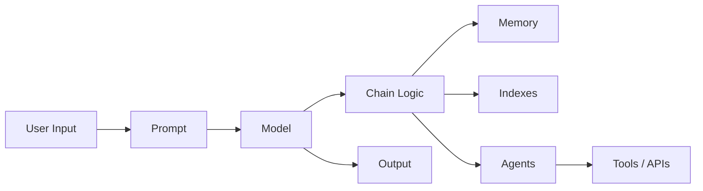
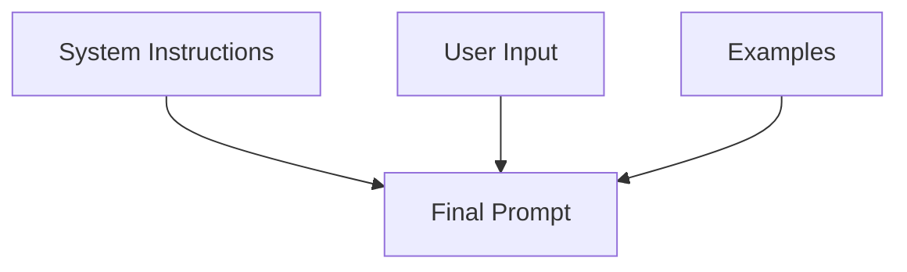
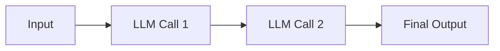
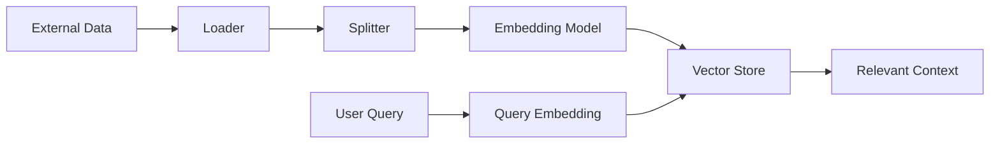
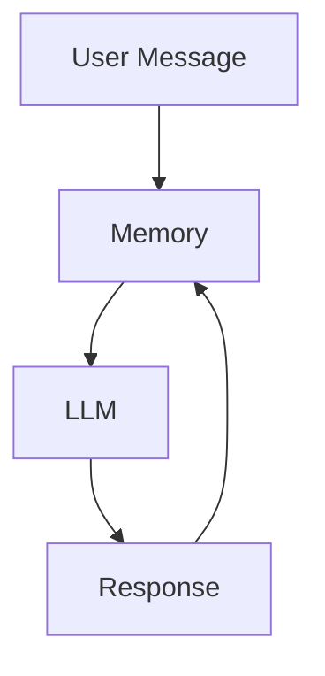
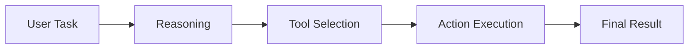

# 📘 LangChain Framework: Architecture & Core Components

---

## 1️⃣ Lecture Objective

This lecture provides a **conceptual foundation of the LangChain framework**, explaining **why it exists**, **how it is structured**, and **what its six core components are**.
The focus is **understanding before implementation**, preparing learners for future hands-on tutorials.

---

## 2️⃣ Why Conceptual Understanding Matters

Most tutorials jump directly into:

* Projects
* Code snippets
* Demos

❌ This leads to:

* Shallow understanding
* Inability to debug
* Poor system design decisions

✅ LangChain requires **architectural thinking**, not just API usage.

This playlist **prioritizes concepts first**, then coding.

---

## 3️⃣ LangChain Framework Overview

### What is LangChain?

**LangChain** is an **open-source framework** for building applications powered by **Large Language Models (LLMs)**.

It:

* Orchestrates multiple components
* Reduces manual glue code
* Enables scalable, modular LLM systems

---

## 4️⃣ Recap from Previous 
LangChain enables:

* Building **complex systems** (e.g., PDF chat applications)
* Managing multiple components efficiently
* Automatic data flow using **chains**
* **Model-agnostic development**
  (Switch OpenAI → Google models with minimal changes)

---

## 5️⃣ High-Level Architecture of LangChain

---

## 6️⃣ The Six Core Components of LangChain

LangChain is built around **six foundational components**:

1. **Models**
2. **Prompts**
3. **Chains**
4. **Indexes**
5. **Memory**
6. **Agents**

Each component solves a **specific system-level problem**.

---

## 7️⃣ Component 1: Models

### Definition

Models provide a **standardized interface** to interact with AI models.

---

### Problems Solved

* LLMs enable:

  * Natural Language Understanding (NLU)
  * Context-aware generation
* Models are **huge (>100GB)** → local hosting impractical
* APIs differ across providers:

  * Different formats
  * Different response structures

---

### LangChain Solution

* Single interface for:

  * OpenAI
  * Anthropic
  * Cohere
  * HuggingFace
* Minimal code changes when switching providers

---

### Types of Models

| Model Type       | Input | Output | Usage                       |
| ---------------- | ----- | ------ | --------------------------- |
| Language Models  | Text  | Text   | Chat, Q&A, summarization    |
| Embedding Models | Text  | Vector | Semantic search, similarity |

---

## 8️⃣ Component 2: Prompts

### Definition

Prompts are the **instructions sent to LLMs**.

---

### Why Prompts Matter

* Small changes → drastically different outputs
* Prompt design directly affects system behavior

---

### Supported Prompt Techniques

* **Dynamic prompts** (placeholders)
* **Reusable templates**
* **Role-based prompting**
* **Few-shot prompting** (examples inside prompt)

---

### Example Prompt Flow

📌 Prompt Engineering is an **emerging discipline**.

---

## 9️⃣ Component 3: Chains

### Definition

Chains are **pipelines of LLM calls** where outputs automatically feed into the next step.

---

### Types of Chains

| Chain Type  | Description            | Example                            |
| ----------- | ---------------------- | ---------------------------------- |
| Sequential  | Step-by-step execution | Translate → Summarize              |
| Parallel    | Multiple tasks at once | Generate multiple reports          |
| Conditional | Logic-based flow       | If sentiment negative → send email |

---

### Chain Architecture

✅ Chains eliminate manual data passing logic.

---

## 🔟 Component 4: Indexes

### Purpose

Indexes connect LLMs to **external knowledge sources**.

---

### Why Indexes Are Needed

* LLMs:

  * Are trained on public data
  * Cannot access private or proprietary data

Indexes solve this limitation.

---

### Index Components

| Subcomponent    | Role                     |
| --------------- | ------------------------ |
| Document Loader | Load PDFs, websites, DBs |
| Text Splitter   | Chunk documents          |
| Vector Store    | Store embeddings         |
| Retriever       | Fetch relevant chunks    |

---

### Index Workflow

---

## 1️⃣1️⃣ Component 5: Memory

### The Problem

LLM APIs are **stateless**:

* Each request forgets previous interactions

---

### LangChain Memory Solution

Memory stores:

* Conversation history
* Summaries
* Custom user data

---

### Types of Memory

| Memory Type         | Description                |
| ------------------- | -------------------------- |
| Conversation Buffer | Stores full chat history   |
| Buffer Window       | Stores last N interactions |
| Summary Memory      | Stores summarized context  |
| Custom Memory       | Stores user preferences    |

---

### Memory Flow

---

## 1️⃣2️⃣ Component 6: Agents

### Definition

Agents are **action-capable AI systems**, not just chatbots.

---

### Chatbot vs Agent

| Feature         | Chatbot | Agent |
| --------------- | ------- | ----- |
| Text generation | ✅       | ✅     |
| Reasoning       | ❌       | ✅     |
| Tool usage      | ❌       | ✅     |
| Task execution  | ❌       | ✅     |

---

### Agent Capabilities

* API calls
* Calculations
* Tool selection
* Step-by-step reasoning

Agents use **chain-of-thought prompting** internally.

---

### Agent Workflow

📌 Agents are predicted to be a **major AI trend**.

---

## 1️⃣3️⃣ Summary Table: LangChain Components

| Component | Role                 | Key Concepts          |
| --------- | -------------------- | --------------------- |
| Models    | AI interaction layer | API abstraction       |
| Prompts   | Instructions         | Prompt engineering    |
| Chains    | Pipelines            | Sequential / Parallel |
| Indexes   | External knowledge   | Vector search         |
| Memory    | Context retention    | Stateful conversation |
| Agents    | Action execution     | Reasoning + tools     |

---

## 1️⃣4️⃣ Key Insights

* LangChain simplifies **complex LLM system design**
* Modular architecture enables scalability
* Abstracts:

  * API differences
  * Stateless behavior
  * Knowledge limitations
* Agents represent the next evolution of AI apps

---

## 1️⃣5️⃣ Final Conclusion

This lecture establishes a **conceptual roadmap** for LangChain by:

* Explaining *why* it exists
* Breaking down *how* it works
* Preparing learners for implementation
